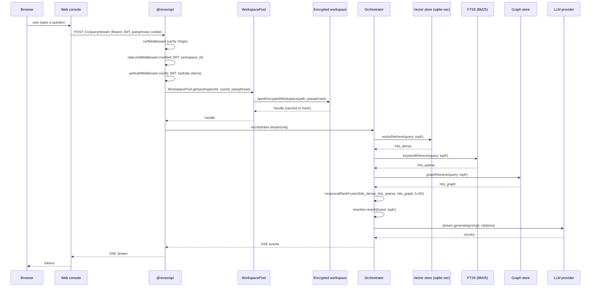

# Architecture — Data flow

This page traces a single user query through every component of
the system, end to end. Use it as a map when you're debugging
or extending the engine.

## The request

## What happens at each hop

### 1. Browser → Web console

The web console runs the chat composer (`apps/web/src/app/(app)/chat/`).
The `useRevexStream` hook posts `POST /api/proxy` with the
`x-revex-path: /v1/query/stream` header. The browser carries
`revex_session` and `revex_workspace_key` cookies automatically;
the web console never reads them.

### 2. Web console → API

`apps/web/src/app/api/proxy/route.ts` forwards the request to
`REVEX_API_BASE` (default `http://localhost:3000`) with the
server-to-server `x-revex-forwarded: 1` header. Cookies ride
along; `authorization` is added if the incoming request had one.

### 3. API middleware chain

`createApp` wires the middleware in order:

1. **`securityHeadersMiddleware`** — CORS, `X-Content-Type-Options`,
   `Referrer-Policy`, `X-Frame-Options`, `Permissions-Policy`.
   When `REVEX_CSP` is set: `Content-Security-Policy`. When
   `REVEX_PROFILE=production`: `Strict-Transport-Security`.
2. **`errorMiddleware`** — maps `RevexError.code` → HTTP status.
3. **`csrfMiddleware`** — rejects state-changing requests with
   a mismatched `Origin`.
4. **`rateLimitMiddleware`** — signature-verified per-IP and
   per-workspace buckets.
5. **`jwtAuthMiddleware`** — verifies the JWT (only on
   protected routes mounted under `protectedApp`).

### 4. Workspace resolution

The handler calls `workspaceContextFrom(c, deps)`. The function:

1. Pulls claims from the request context.
2. Resolves the workspace entry from the `WorkspaceRegistry`.
3. Asks the `WorkspacePool` for a handle keyed by
   `(workspaceId, userId)`.
4. If no entry is cached, opens the encrypted workspace via
   `openEncryptedWorkspace({ path, passphrase })`.
5. Builds per-request stores (`userStore`, `documentStore`,
   `jobQueue`, `memberStore`, ...) bound to the handle.

The `WorkspacePool` is bounded by `maxHandles` (default 64).
Entries are evicted on overflow using an LRU policy.

### 5. Orchestrator

The orchestrator runs the configured pattern (`graph` /
`swarm` / `workflow`). The bundled `InProcessAdapter` does the
following per request:

1. `retriever.retrieve(req, state)` — runs the dense and BM25
   retrievers in parallel; collects hits.
2. `reciprocalRankFusion(hits, k=60)` — fuses the per-source
   hits.
3. `reranker.rerank(fused, topK)` — re-ranks with the
   configured reranker (`identity`, `bge`, `cohere`,
   `llm_judge`).
4. `generator.generate(req, hits, state)` — formats a prompt
   with the top-K hits as context, calls the LLM, and streams
   the response.

### 6. SSE stream

`streamSSE` (Hono) emits one event per chunk. The web console's
`useRevexStream` hook appends each chunk to the assistant
message in real time.

## What happens to errors

Any thrown `RevexError` is mapped to its HTTP status by
`errorMiddleware`. The error code and message are returned as
JSON. The web console renders the error inline in the chat
trace.

## What happens at shutdown

The `SIGTERM` / `SIGINT` handlers in `packages/api/src/index.ts`:

1. Drain the `WorkspaceWorkerSupervisor` so in-flight ingestion
   jobs reach `done` instead of being stuck in `running`.
2. Flush the `WorkspacePool` (`pool.closeAll()`).
3. Exit cleanly (`process.exit(0)`).

A replica with `REVEX_WORKER_ROLE=follower` skips the
supervisor entirely and serves HTTP only. A deployment with
exactly one `leader` and any number of `follower` replicas
gets leader-elected ingestion without external coordination.
