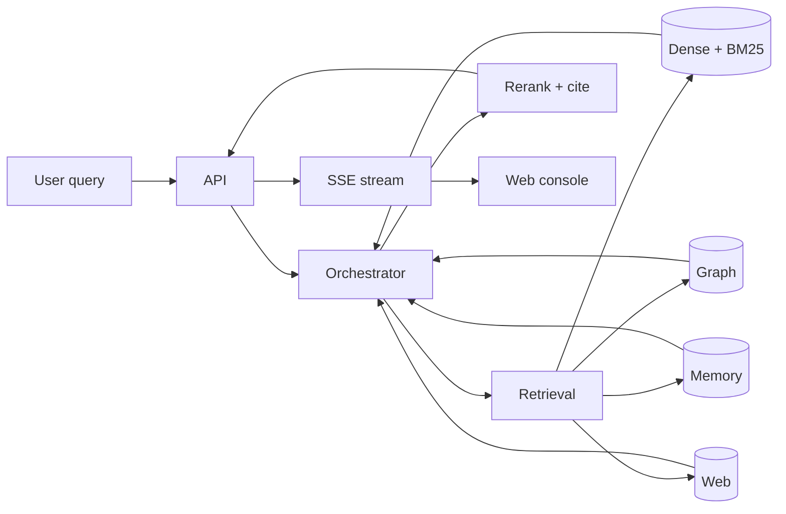

# Revex — hybrid retrieval for teams

Revex is a **hybrid retrieval engine** for teams that need
denser, more honest answers from their own documents. You point
it at a folder of files; it gives you an HTTP API and a web
console that fuses dense vector search, BM25 keyword search,
graph search, per-session memory, and live web search into one
ranked answer.



## The problem

Most RAG systems pick one retrieval strategy and call it a day.

| Strategy | What it misses |
|---|---|
| Dense vectors | Exact keywords, codes, identifiers. |
| BM25 | Paraphrases, semantic similarity. |
| Graph | Conversation history, working memory. |
| Memory | Session-level facts and preferences. |
| Web | Anything that changed since indexing. |

RAG quality lives in the *combination*. Picking one mode is a
deliberate choice to be wrong about the other four.

## The answer

Revex runs **multiple retrievers in parallel** and fuses the
results with **Reciprocal Rank Fusion** (`k=60`), scoped by
**per-user workspace RBAC**. You configure the strategy per
workspace member; the orchestrator does the rest.

```ts
import { hybridSearch, createReranker, reciprocalRankFusion } from '@revex/core';

const results = await hybridSearch({
  workspaceId,
  userId,
  query: 'what does the security policy say about encryption at rest?',
  topK: 10,
  retrievers: ['vector', 'keyword', 'graph', 'memory', 'web'],
});

const ranked = reciprocalRankFusion(results, { k: 60 });
const final = await createReranker('identity').rerank(ranked);
```

## What you get

- **Five retrieval sources fused with RRF** — `vector`,
  `keyword`, `graph`, `memory`, `web` — one ranked answer.
- **Per-workspace RBAC** — document, group, and role ACLs
  enforced at the SQLite layer.
- **Encrypted workspaces** — scrypt-derived AES-256-GCM keys,
  passphrase-gated. Lose the passphrase and the database stays
  opaque.
- **Strands-shaped orchestrator** — Graph / Swarm / Workflow
  pattern builders behind one façade. The bundled in-process
  adapter is the supported runtime today; the real Strands
  Agents SDK is an optional peer dependency.
- **Async ingestion** — `POST /v1/documents` returns
  `202 {status: 'pending'}`; a background worker per workspace
  drains the queue, runs `ingest()`, and flips the row to
  `ready` or `failed`.
- **SSE streaming** — `/v1/query/stream` streams tokens through
  a Next.js proxy with no buffering.
- **Web console** — Next.js 16 + shadcn/ui. Light theme for the
  marketing surface, dark theme for the app shell.
- **CLI** — `pnpm --filter @revex/cli dev --` exposes
  `init | server | ingest | query | feedback | eval | queue |
  tenant | backup | docs | naming`.
- **Telemetry** — `NoOpTelemetry` (default), `LangfuseTelemetry`,
  `OtelTelemetry`. Swap with one env var.

## Layout

```text
revex/
├── packages/
│   ├── core/           @revex/core          domain, stores, retrieval, auth, telemetry, LLM
│   ├── orchestrator/   @revex/orchestrator  Strands-shaped Orchestrator + agents + tools
│   ├── api/            @revex/api           Hono HTTP server
│   └── eval/           @revex/eval          retrieval metrics + benchmarks
├── apps/
│   ├── web/            @revex/web           Next.js 16 console (private)
│   └── cli/            @revex/cli           `revex` binary
└── docs/               this documentation
```

## Five-minute path

| Time | What you do | Where to look |
|---|---|---|
| 0 min | Install Node.js 26 + pnpm 9 | [Installation](install.md) |
| 5 min | Boot the API + web console locally | [Quickstart](quickstart.md) |
| 10 min | Walk the 5-step onboarding wizard | [Onboarding](guide/onboarding.md) |
| 20 min | Ingest your first document, run a query | [Ingestion](guide/ingestion.md) |
| 30 min | Wire the API into your product | [HTTP API](reference/api.md) |
| 1 hour | Deploy with the production hardening checklist | [Security hardening](operations/security.md) |

## Where to go next

- **New to Revex?** Start with the [Quickstart](quickstart.md).
  You'll have a working `POST /v1/query` against your own
  documents in ten minutes.
- **Tinkering with the engine?** Read the
  [Architecture overview](architecture/overview.md) and the
  [Hybrid retrieval](guide/retrieval.md) guide.
- **Building with it?** The [HTTP API reference](reference/api.md)
  is the canonical reference; the
  [Examples](examples/index.md) walk through minimal,
  intermediate, advanced, and custom-plugin use cases.
- **Running it in production?** Skip to the
  [Security hardening](operations/security.md) checklist and the
  [Deployment](operations/deployment.md) guide.

## Support

- [GitHub discussions](https://github.com/sachncs/revex/discussions)
  for questions and ideas.
- [GitHub issues](https://github.com/sachncs/revex/issues) for
  bugs and feature requests.
- [security@sachncs.dev](mailto:security@sachncs.dev) for
  private disclosure — see [Security](operations/security.md).

## License

Revex is released under the [MIT License](https://github.com/sachncs/revex/blob/master/LICENSE).
