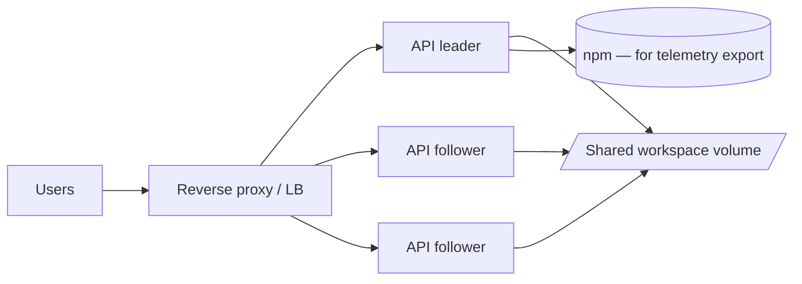

# Deployment

This page covers the production deployment topology, the
recommended process manager, and the operational signals worth
watching.

## Topology

A production deployment has at minimum:

- **One HTTP replica** with `REVEX_WORKER_ROLE=leader` — runs
  the API, the `WorkspaceWorkerSupervisor`, and serves
  `/v1/query/stream`.
- **Zero or more HTTP replicas** with
  `REVEX_WORKER_ROLE=follower` — serve HTTP only; their
  supervisor is disabled. Use these for horizontal scale.
- **One storage layer** — `${REVEX_WORKSPACE_HOME}` mounted on
  shared storage (NFS, EFS, ReadWriteMany PVC) when there is
  more than one replica. SQLite's lock contention is acceptable
  up to ~10 concurrent writers; for higher throughput, run a
  single-leader deployment.
- **One reverse proxy** — nginx, Caddy, or a cloud load
  balancer. Terminates TLS, sets the real client IP, and
  forwards the request to the API.



## Environment

Copy `.env.example` to `.env.production` and fill in:

| Variable | Notes |
|---|---|
| `REVEX_PROFILE` | `production`. |
| `REVEX_JWT_SECRET` | `openssl rand -base64 48`. |
| `REVEX_TENANT_SECRETS_KEY` | `openssl rand -hex 32`. |
| `REVEX_WORKSPACE_HOME` | A directory on shared storage. |
| `REVEX_API_PORT` | The internal port (default 3000). |
| `REVEX_CORS_ORIGINS` | The real frontend origin (no wildcard). |
| `REVEX_CSP` | A conservative CSP. |
| `REVEX_TRUSTED_PROXY_CIDRS` | The proxy / LB CIDR. |
| `REVEX_LLM_*` | Provider, model, and key. |
| `REVEX_TELEMETRY_PROVIDER` | `langfuse` or `otel`. |
| `REVEX_WORKER_ROLE` | `leader` on exactly one replica. |

See [Configuration](../configuration.md) for the full list.

## Reverse proxy

nginx example:

```nginx
upstream revex_api {
    server 10.0.1.10:3000;
    server 10.0.1.11:3000;
    server 10.0.1.12:3000;
}

server {
    listen 443 ssl http2;
    server_name api.example.com;
    ssl_certificate     /etc/letsencrypt/live/api.example.com/fullchain.pem;
    ssl_certificate_key /etc/letsencrypt/live/api.example.com/privkey.pem;

    location / {
        proxy_pass http://revex_api;
        proxy_set_header Host              $host;
        proxy_set_header X-Real-IP         $remote_addr;
        proxy_set_header X-Forwarded-For   $proxy_add_x_forwarded_for;
        proxy_set_header X-Forwarded-Proto $scheme;
        proxy_http_version 1.1;
        proxy_buffering off;  # required for SSE streaming
    }
}
```

The `proxy_buffering off` line is critical — without it, nginx
buffers the entire SSE response and the chat UI sees no tokens
until the answer is complete.

## Process manager

A small systemd unit is enough:

```ini
[Unit]
Description=Revex API
After=network-online.target
Wants=network-online.target

[Service]
Type=simple
User=revex
WorkingDirectory=/srv/revex
EnvironmentFile=/srv/revex/.env.production
ExecStart=/usr/bin/node --enable-source-maps node_modules/turbo/bin/turbo run \
  --filter=@revex/api start
Restart=always
RestartSec=5
LimitNOFILE=65536

[Install]
WantedBy=multi-user.target
```

Build the workspace once before starting:

```bash
sudo -u revex bash -lc 'pnpm install --frozen-lockfile && pnpm turbo run build'
```

## Resource sizing

| Tier | CPU | Memory | Disk | Notes |
|---|---|---|---|---|
| Single user / dev | 1 vCPU | 1 GB | 5 GB | SQLite + 1 workspace. |
| Team (≤ 20 users) | 2 vCPU | 4 GB | 50 GB | Single-leader, in-memory pool. |
| Production (≤ 200 users) | 4 vCPU | 8 GB | 200 GB | Single-leader + 2 followers. |
| Production (≤ 1000 users) | 8 vCPU | 16 GB | 500 GB | Single-leader + 5 followers, dedicated DB volume. |

SQLite dominates disk I/O once you have many concurrent
ingestion jobs. Mount the workspace home on a high-IOPS volume
(premium SSD) and prefer NVMe locally.

## Operational signals

Watch these in your monitoring:

| Signal | Source | Threshold |
|---|---|---|
| HTTP 5xx rate | reverse proxy logs | < 0.1 % over 5 min. |
| `auth_error` rate | API logs | < 1 % of requests. |
| `rate_limit` rate | API logs | < 5 % of requests. |
| Per-workspace queue depth | `ingestion_jobs.status='pending'` count | < 100 per workspace. |
| Job worker lag | `now - max(updated_at)` for `running` jobs | < 60 s. |
| Workspace pool size | `pool.size()` in `/readyz` | < 80 % of `maxHandles`. |

A simple health check:

```bash
curl -fsS https://api.example.com/health
# {"ok":true}
```

And a deeper readiness check (used by k8s `readinessProbe`):

```bash
curl -fsS https://api.example.com/readyz
# {"ok":true,"workspaces":3,"poolSize":12}
```

The readyz probe returns 503 if the registry or the pool fails
to respond, so load balancers can drain the replica on trouble.

## Upgrades

1. Pull the new tag.
2. Run `pnpm install --frozen-lockfile` and `pnpm turbo run
   build`.
3. Restart one replica at a time. The `WorkspacePool` is
   process-local, so each replica opens its own handles on
   startup; no warm-up step is required.
4. The leader replica continues to drain in-flight jobs
   before exit (SIGTERM handler in `packages/api/src/index.ts`).

For breaking upgrades, follow the [Migration](../MIGRATION.md)
guide and run the migration script before flipping traffic.

## What's next

- [Security hardening](security.md) — the production checklist.
- [Configuration](../configuration.md) — every env var.
- [Troubleshooting](../troubleshooting.md) — common failure modes.
